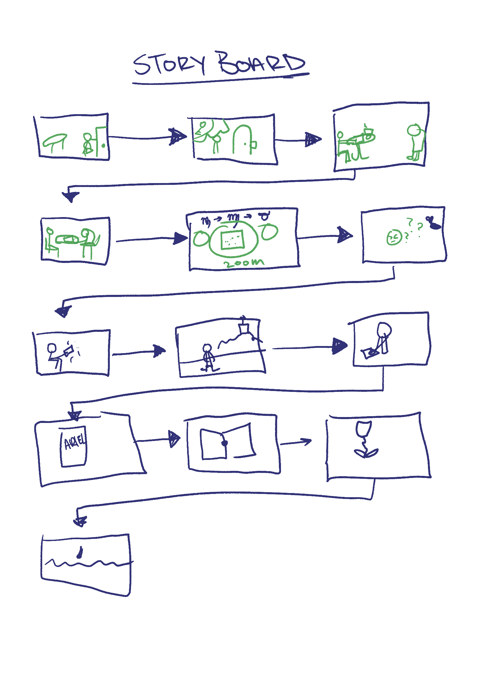

Backstory:
After graduating undergrad I travelled to Europe for a year with my homebase in Paris.

One morning, after making a cup of coffee, I grabbed my phone and notebook and headed downstairs to smoke a cigarette.
After a bit of writing and finishing my cigarette I went to go back up to get ready for the day.
I then realized I had forgotten my keys to the apartment.
Mind you, not only is it a Sunday where almost every store in Paris is closed, it is also August-- The month almost every Parisian goes on Vacation.
I call my airbnb host to find out that she is currently in Russia and there is no spare key.
Now my french is good enough to get by, but I am nowhere capable enough to explain my situation in French. 
I head to a cafe to drink a coffee and try to plan out what to do. I was staying in the 18e arrondissment, which isn't exactly tourist-friendly.
While I am there, a lady comes up to me and said, "I can help you Anurahda".
Now I'm confused and many questions are running through my head.. How did she know I spoke english, How did she know I needed help.
She said, "can I read you your horoscope?" I had time to kill and my motto is do it for the plot so she sat down, pulled out a iPhone 14X Plus Pro Max and asked me for my birth info which she entered into some website calculator.
She pulled out a piece of paper which had some sort of template. and told me my moon sign, Scorpio. My rising sign, Cancer, and my Sun sign, Virgo. (She used vedic names, which I later discovered after I redid my chart). She told me a bunch of things but didn't once mention that I had been locked out and of what to do. But she got up and said, "These roses are like lead sinkers."
I was left perplexed as she got up and disappeared into the crowd. I ended up having to wait a few days, a someone who later became my boyfriend at the time invited me to Marseille. When I arrive he hands me a book and said "this is the only Sylvia Plath book at the shop that was in English." The Book was Ariel.
We had talked prior about poetry and I had told him that I just finished the Bell Jar.

